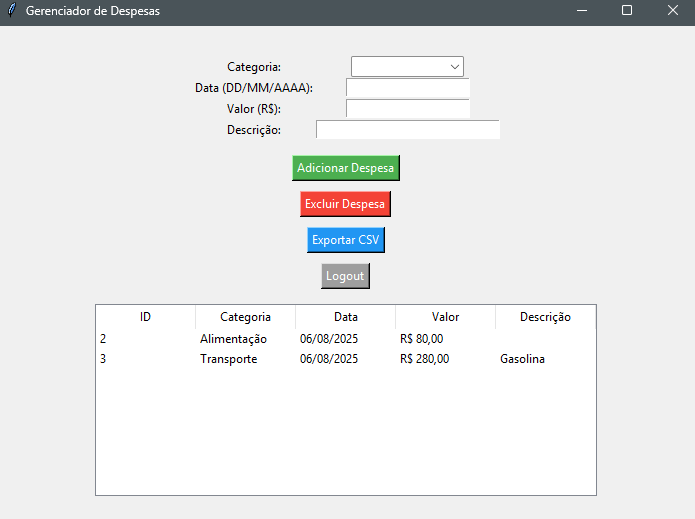

# 💰 Gerenciador de Despesas com Python + Tkinter

Sistema de gerenciamento de despesas pessoais com **interface gráfica (Tkinter)** e **armazenamento local em SQLite**.

Permite login de usuário, adição, exclusão e exportação de despesas, com **formatação automática de data e valor** e **relatório total de gastos**.

---

## 📸 Preview

> 

---

## ✅ Funcionalidades

- [x] Login com autenticação
- [x] Cadastro de despesas com:
  - Categoria
  - Data (formato DD/MM/AAAA com preenchimento automático)
  - Valor (formatação em tempo real - R$ 0.000,00)
  - Descrição
- [x] Listagem de despesas em tabela
- [x] Exclusão de despesas
- [x] Exportar despesas para CSV
- [x] Cálculo do total de gastos
- [x] Logout do usuário

---

## 🚀 Como executar

1. Clone o repositório:
   ```bash
   git clone https://github.com/seu-usuario/gerenciador-despesas.git
   cd gerenciador-despesas
